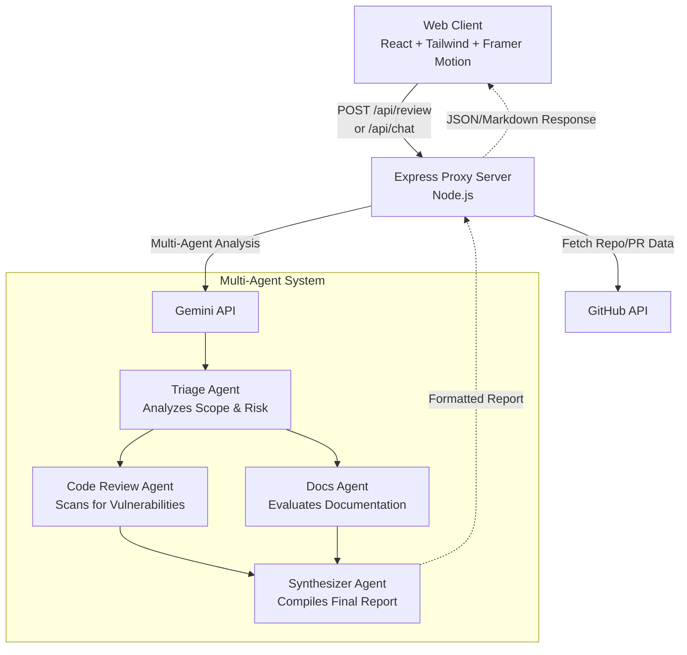

# 🛡️ RepoGuard: AI-Powered Repository Security Companion

RepoGuard is a state-of-the-art multi-agent repository auditor and security companion designed to scan source code repositories and Pull Requests. It automatically identifies security vulnerabilities, exposes leaked secrets or API credentials, evaluates logic bugs, inspects code styles, and generates documentation verdicts. It also features a conversational AI companion to assist developers in reviewing findings and implementing immediate mitigations.

---

## 🛑 The Problem

Modern software development moves incredibly fast. Developers continuously push code to repositories, but comprehensive security audits, code quality checks, and documentation reviews often lag behind. Traditional static analysis tools generate noisy, context-less alerts that developers ignore, while manual code reviews are time-consuming and prone to human error. There is a critical need for an automated, context-aware system that doesn't just flag issues but understands the codebase, explains vulnerabilities, and helps remediate them intelligently.

## 💡 The Solution & Why Agents?

RepoGuard solves this by deploying a **Multi-Agent AI System** that acts as an intelligent security and review companion. Instead of relying on a single monolithic LLM prompt, RepoGuard utilizes specialized, autonomous AI agents powered by the Gemini API. 

**Why Agents uniquely help solve this problem:**
- **Specialization**: Each agent has a distinct persona and focus (e.g., the Code Review Agent strictly looks for vulnerabilities and logic bugs, while the Docs Agent evaluates documentation compliance). This separation of concerns significantly improves the accuracy and depth of the analysis.
- **Contextual Understanding**: Agents can synthesize findings across the repository, understanding how a vulnerability in one file might impact another, a feat static analyzers struggle with.
- **Actionable Remediation**: Beyond static reports, our Conversational AI Companion agent allows developers to chat directly about the findings, ask for specific mitigation strategies, and get step-by-step guidance dynamically.

---

## ✨ Features

- **🔐 Real GitHub OAuth Integration**: Securely connect your GitHub account via a seamless OAuth flow with robust local state wiping on disconnect.
- **🗃️ Dynamic Repository Grid**: Authenticated users receive a state-flipping dashboard that fetches and filters their live GitHub repositories via the official API for instant audit execution.
- **🎛️ Repo Health Matrix**: A multi-dimensional scorecard widget in the report view that breaks down security, accessibility, test coverage, and code cleanliness into semantic color-coded progress indicators.
- **🔍 Comprehensive Security Audits**: Performs full-scope security reviews on actual repository files to spot leaked credentials, logic bugs, and structural flaws.
- **🤖 Multi-Agent Analysis Pipeline**:
  - **Triage Agent**: Analyzes the size, scope, and initial risk metrics of the codebase.
  - **Code Review Agent**: Scans line-by-line for memory leaks, logic bugs, style violations, and exposed secrets.
  - **Docs Agent**: Checks README compliance, inline code comments, and outdated documentation segments.
  - **Synthesizer Agent**: Compiles individual agent reports into a unified markdown summary.
- **💬 AI Chatbot Companion**: An interactive sidebar assistant that lets you query the codebase, ask about specific vulnerabilities, and receive step-by-step remediation advice.
- **⚙️ Configurable Audit Depth**: Toggle between **Rapid Threat Check** (Concise), **Full Scope Engine** (Standard), and **Cryptographic Trace** (Deep) to suit your speed and coverage needs.
- **🔐 Secure API Key Sandbox**: Input your own Gemini API key or GitHub Personal Access Token (PAT) inside a secure client sandbox, which is saved locally in your browser.
- **🎨 Premium Responsive UI**: Translucent glassmorphism header, smooth hardware-accelerated logo animations, dark/light theme alignment, and beautiful dashboard elements.

---

## 🛠️ Architecture Overview

RepoGuard is built as a single-page application (SPA) backed by a secure proxy server to negotiate Gemini and GitHub API interactions without exposing secrets:



This architecture ensures that API keys (Gemini API Key, GitHub PAT) remain secure within the proxy layer, while delivering a robust, dynamic experience to the user.

---

## 📁 Project File Structure

```
repoguard/
├── agents/
│   ├── agentUtils.ts               # Core utility functions and Gemini client abstractions
│   ├── codeReviewAgent.ts          # Line-by-line vulnerability and logic scanner
│   ├── docsAgent.ts                # Documentation compliance and style evaluator
│   ├── synthesizerAgent.ts         # Aggregator that compiles final markdown reports
│   └── triageAgent.ts              # Initial scope and risk metric analyzer
├── src/
│   ├── components/
│   │   ├── AgentStepper.tsx        # Multi-agent visual progression stepper
│   │   ├── ChatbotCompanion.tsx    # Sidebar AI chat assistant interface
│   │   ├── MarkdownLite.tsx        # Optimized lightweight markdown renderer
│   │   └── ReportView.tsx          # Detailed audit reports and code patch diff views
│   ├── types.ts                    # TypeScript interfaces (ReviewResponse, CodeIssue, etc.)
│   ├── App.tsx                     # Core workspace application page and splash screen
│   ├── main.tsx                    # React client mounting entrypoint
│   └── index.css                   # Tailwind theme guidelines and baseline styling
├── server.ts                       # Secure Express proxy negotiating Gemini/GitHub APIs
├── index.html                      # HTML SPA client entrypoint
├── package.json                    # Workspace dependencies, build, and start script hooks
├── tsconfig.json                   # Client and server TypeScript compilation config
├── vite.config.ts                  # Vite client dev server and asset bundler rules
├── vercel.json                     # Vercel deployment and routing configuration
└── .env.example                    # Template for required environment variables
```

---

## 🚀 Getting Started

### Prerequisites

Make sure you have [Node.js](https://nodejs.org/) installed (v18 or higher recommended).

### 1. Installation

Clone the repository and install the dependencies:

```bash
npm install
```

### 2. Configure Environment Variables

Create a `.env` file in the root directory (you can copy [.env.example](.env.example)):

```env
# Your primary Gemini API credentials (fallback if not supplied in UI)
GEMINI_API_KEY=your_gemini_api_key_here

# Optional: GitHub token to scan private repositories and prevent API rate-limiting
GITHUB_TOKEN=your_github_personal_access_token
```

### 3. Run Locally

Start the development server:

```bash
npm run dev
```

The application will launch on `http://localhost:3000`.

### 4. Build for Production

To bundle the client files and package the server code:

```bash
npm run build
```

To run the production build:

```bash
npm run start
```

---

## ⚙️ Configuration & Settings

Inside the **Audit System Settings** panel in the UI:
- **Analysis Type Selection**:
  - **Concise**: Fast scans for key risks.
  - **Standard**: Complete logic, security, and structure analysis.
  - **Deep**: Extensive cryptographic trace and risk simulation.
- **GitHub Identity Alignment**: Align your GitHub profile handle to associate scans with your developer username.

---

## 🔒 Security Best Practices

> [!IMPORTANT]
> RepoGuard handles sensitive codebase scans. For public deployments:
> - Do not commit your `.env` files. Ensure they are listed in your `.gitignore`.
> - If deploying to cloud platforms, store `GEMINI_API_KEY` and `GITHUB_TOKEN` as secure system environment variables.

---

## 👥 Authors & Contributors

- **Aryan Raj** - Creator ([GitHub Profile](https://github.com/aryxncodes7))
